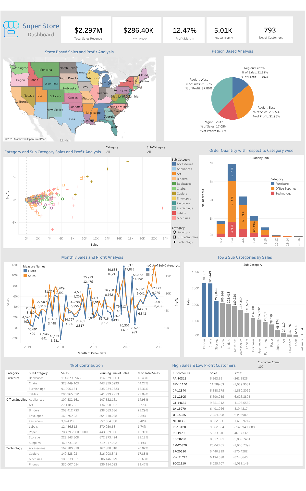

# Profit & Sales Analysis of Superstore

## Project Title : 
Profit & Sales Analysis of Superstore - Data visualization (Using Tableau)

## Project Description : 
Analyzing the data to gain meaningful insights from raw data to support decision-making, identify patterns, and extract valuable information with the help of the Data visualization tool - Tableau. 

This will give meaningful insights and insights will lead to recommendations that help in business to strategies for growth.

## Link to the Dashboard

<a href="https://public.tableau.com/app/profile/harish.kashaboina/viz/SuperStoreDashboard_16924443395390/Dashboard1" target="_blank" rel="noopener noreferrer">
  Super Store Dashboard
</a>

##  Super Store Dashboard

## Data preview 
The dataset contains 21 columns and is like - 
1. Row ID: A distinct row number of each record.
2. Order ID: A distinct code is given to each order placed. The code contains alphanumeric characters.
3. Order Date: The date on which the order was placed.
4. Ship Date: The date on which the order was delivered.
5. Ship Mode: Mode through which order was delivered.
6. Customer ID: A unique/distinct ID for each Customer.
7. Customer Name: Name of the Customer.
8. Segment: Segment the Product belongs to.
9. Country: Name of Country 
10. City: Name of city order delivered.
11. State: Name of State.
12. Postal Code: Postal code of the location
13. Region: The country is divided into different regions. 
14. Product ID: Unique ID of each Product for identification.  
15. Category: Name of the Category Product belongs to.
16. Sub-Category: Name of the Sub-Category.
17. Product Name: Product name.
18. Sales: Amount of Products sold on.
19. Quantity: Number of Product sold at a time. 
20. Discount: Discount Product on sale.
21. Profit: Profit gained on sale of the Product.

## Questions we are going answer with this data : 

1. Understanding the demographic data of states.
2. Category and Sub category sales and profit analysis, Which one is profitable?
3. Year-on-year profit and sales growth. 
4. Understanding the pattern of the profitability of the Product.
5. Low sales and High customers 
6. No. of Orders by category and sub-categories 

## Tools and Language : 

Jupyter Notebook (Python): Used for basic understanding like structure of data (row and columns), checking null values, handling missing values, etc.

Tableau : For visualization of data,interactivity and seamless experience that comes with the dashboard. 

## Link to the Tableau Profile

<a href="https://public.tableau.com/app/profile/harish.kashaboina" target="_blank" rel="noopener noreferrer">
 My Tableau Profile
</a>
